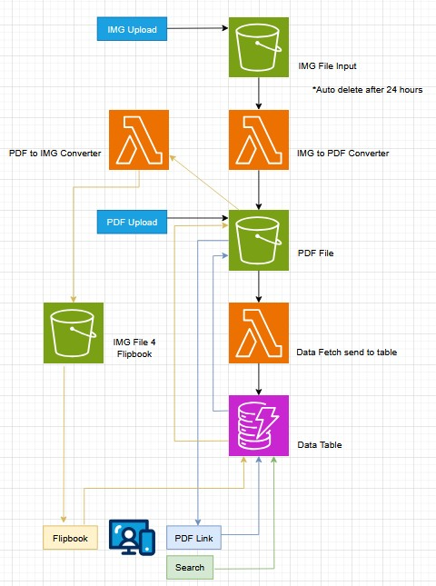

# The Grand Library

## Overview

The Grand Library is a digital library system designed to store, manage, and share PDF books and JPG image-based books securely and efficiently. It leverages AWS services to provide scalable storage via Amazon S3, a searchable database with Amazon DynamoDB, and a user-friendly front end built with React. Users can upload images or PDFs, convert them to PDFs, search for books by title, author, or topic, and access them via a web interface.

## Features
- Storage: Store PDF books and JPG images in Amazon S3 buckets.
- Conversion: Automatically convert JPG images to PDFs using AWS Lambda.
- Search: Search books by title, author, or topic using Global Secondary Indexes (GSIs) in DynamoDB.
- Front End: A React-based web application for uploading, searching, and viewing books.
- Scalability: Designed to handle small to large book collections with parallel processing or EC2 for larger datasets.
- Auto Cleanup: Images in the input S3 bucket are automatically deleted after 24 hours. 

## Architecture

The system follows the AWS architecture outlined below:

## AWS Architecture Diagram

Grand Library AWS Architecture

### Components

1. IMG Upload: Users upload JPG images or PDFs via the React front end to the IMG File Input S3 bucket.
2. IMG File Input S3 Bucket: Stores incoming JPG images with auto-deletion after 24 hours.
3. IMG to PDF Converter: An AWS Lambda function triggered by S3 events converts JPG images to PDFs.
4. PDF File S3 Bucket: Stores the generated PDFs (grandlibrary bucket).
5. PDF Upload: PDFs (either uploaded directly or converted) are stored in the PDF File S3 bucket.
6. Data Fetch to Table: Another Lambda function updates metadata (e.g., title, author, topic) and S3 paths in a DynamoDB table.
7. Data Table (DynamoDB): Contains book metadata with GSIs for searching by TitleIndex, AuthorIndex, and TopicIndex.
8. Flipbook/Search: The React front end searches the DynamoDB table and provides a link to view PDFs (currently via direct S3 URLs, with plans for a Flipbook viewer later).

## Prerequisites

To set up and run the Grand Library project, you’ll need:

- AWS Account: Access to AWS services (S3, Lambda, DynamoDB, API Gateway).
- Node.js and npm: For the React front end (version 16+ recommended).
- AWS CLI: To configure credentials and manage resources.
- Basic Knowledge: Familiarity with AWS, React, and JavaScript.

## Setup Instructions

### AWS Configuration

- S3 Buckets:
    - Create grandlibrary-input for JPG uploads (set Lifecycle Rule for 24-hour auto-deletion).
    - Create grandlibrary for PDF storage (ensure public read access or signed URLs for PDFs).

- Lambda Functions:
    - Deploy IMG to PDF Converter Lambda to convert JPGs to PDFs, triggered by grandlibrary-input events.
    - Deploy Data Fetch to Table Lambda to update DynamoDB with metadata and S3 paths, triggered by grandlibrary events.

- API Gateway:
    - Set up an API endpoint (e.g., /search) to query DynamoDB via Lambda.

- IAM Roles/Policies:
    - Ensure Lambda has permissions for S3 (read/write) and DynamoDB (read/write).
    - Ensure front end has access to S3 (via signed URLs or public access) and API Gateway.

## Known Limitations

- Currently, PDFs open directly in a new tab; Flipbook integration is pending backend work.
- Large books (e.g., 100+ pages) may require parallel Lambda processing or an EC2 instance for conversion.

## Future Improvements

- Implement Flipbook for interactive PDF viewing.
- Add parallel processing for large books using AWS Step Functions.
- Enhance search with pagination or filtering.
- Add user authentication and permissions.
